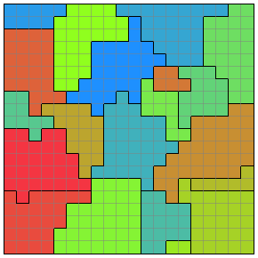

# Story

APPLE ARTIS Corporation (commonly known as AA Corporation) is a company engaged in the mass production of apples. Recently, after many years of research, they have successfully developed an innovative machine capable of generating apples from nothing.

<div style="display: flex; width: 100%;">
  <div style="flex-basis: 40%; text-align: center; margin-right: 10%;">
    
	<p>Accurate map</p>
  </div>
  <div style="flex-basis: 50%; text-align: center;">
    
	<p>Small map correctly representing adjacencies</p>
  </div>
</div>

However, to begin full-scale mass production of apples using this machine, it is necessary to mass-produce the machines themselves. To achieve this, AA Corporation has established a hierarchical system in which machines are created to produce apple-generating machines, and machines are created to produce those machine-producing machines, and so on.

As an engineer at AA Corporation, you have been tasked with developing a production planning algorithm that utilizes this hierarchy of machines to produce as many apples as possible.

# Problem Statement

There are \(N \times L\) types of machines, composed of \(N\) types of IDs and \(L\) types of Levels. A machine with Level \(i\) and ID \(j\) is referred to as **machine \(j^i\)** (\(0 \leq i < L,\ 0 \leq j < N\)).

The production capacity of machine \(j^0\) is \(A_j\). The initial cost of machine \(j^i\) is \(C_{i,j}\).

Your objective is to maximize the total number of apples at the end of \(T\) turns, following the procedure of the production plan below.

## Procedure of the Production Plan

Let \(B_{i,j}\) be the number of machines \(j^i\), and initially all \(B_{i,j}\) are set to 1.  
Also, let \(P_{i,j}\) be the power of machine \(j^i\), and initially all \(P_{i,j}\) are set to 0.

The initial number of apples at the start of the plan is \(K\).  
Each turn proceeds according to the following steps:

1. You choose one of the following two actions:
   - Strengthen machine \(j^i\): Consume \(C_{i,j} \times (P_{i,j} + 1)\) apples to increase \(P_{i,j}\) by 1. However, you cannot strengthen if it would result in a negative number of apples.
   - Do nothing.
2. For all machines \(j^i\), perform the following in the order of Level 0, 1, 2, 3:
   - For Level 0 machines (\(i = 0\)):
     - Increase the number of apples by \(A_j \times B_{i,j} \times P_{i,j}\).
   - For machines of Level 1 or higher (\(i \geq 1\)):
     - Increase \(B_{i-1,j}\) by \(B_{i,j} \times P_{i,j}\).

Choose your actions wisely to maximize the number of apples at the end of \(T\) turns.

# Scoring

Let \(S\) be the number of apples at the end of \(T\) turns. Your score is calculated as \(\mathrm{round}(10^5 \times \log_2 S)\).  
The higher the score, the better.

The following cases will result in a WA:

- Performing a strengthening action that results in the number of apples becoming less than \(0\)
- Specifying a non-existent machine Level or ID
- Taking fewer than \(T\) actions

There are \(150\) test cases, and the score of a submission is the total score for each test case.  
If your submission produces an illegal output or exceeds the time limit for some test cases, the submission itself will be judged as WA or TLE , and the score of the submission will be zero.  
The highest score obtained during the contest will determine the final ranking, and there will be no system test after the contest.  
If more than one participant gets the same score, they will be ranked in the same place regardless of the submission time.

---

# Input

Input is given from Standard Input in the following format.

```
N L T K
A_0 A_1 \cdots A_{N-1}
C_{0,0} C_{0,1} \cdots C_{0,N-1}
C_{1,0} C_{1,1} \cdots C_{1,N-1}
\vdots
C_{L-1,0} C_{L-1,1} \cdots C_{L-1,N-1}
```

- The first line contains four integers \(N, L, T, K\):
  - \(N\) is the number of machine IDs, and \(N = 10\).
  - \(L\) is the number of machine Levels, and \(L = 4\).
  - \(T\) is the total number of turns, and \(T = 500\).
  - \(K\) is the number of apples at the start of the plan, and \(K = 1\).
- The second line contains \(N\) space-separated integers \(A_0, A_1, \dots, A_{N-1}\) representing the production capacities of Level 0 machines:
  - \(A_j\) is the production capacity of machine \(j^0\), satisfying \(1 \leq A_j \leq 100\).
  - \(A\) is sorted in ascending order (\(A_0 \leq A_1 \leq \cdots \leq A_{N-1}\)).
- The following \(L\) lines each contain \(N\) space-separated integers \(C_{i,j}\):
  - \(C_{i,j}\) is the initial cost of machine \(j^i\), satisfying \(1 \leq C_{i,j} \leq 1.25 \times 10^{12}\).

# Output

Output exactly \(T\) lines.  
Each line should describe the action taken on turn \(t\) (\(0 \leq t < T\)), in order from turn 0, using the following format:

- To strengthen machine \(j^i\):

```
i j
```

- To do nothing:

```
-1
```

Your program may include comment lines in the output that start with `#`.

# Input Generation

The function \(\mathrm{rand\_double}(L, U)\) represents generating a real number uniformly at random between \(L\) and \(U\).

## Generation of \(A_j\)

- When \(j = 0\): set \(A_0 = 1\)
- When \(j \neq 0\): set \(A_j = \mathrm{round}(10^{\mathrm{rand\_double}(0,2)})\)
- After generating all values, sort the array \(A\) in ascending order

## Generation of \(C_{i,j}\)

- When \(i = 0\) and \(j = 0\): set \(C_{0,0} = 1\)
- Otherwise: set \(C_{i,j} = \mathrm{round}(A_j \times 500^i \times 10^{\mathrm{rand\_double}(0,2)})\)
